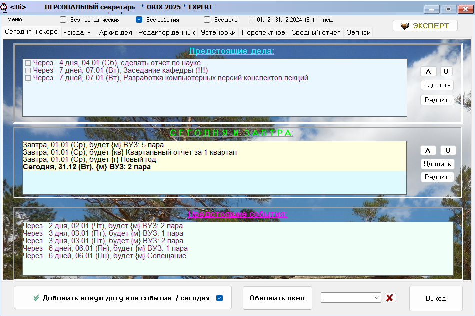

# Orix2024
**Персональный личный секретарь с экспертом дел и поступков.**

Orix - Программа является многофункциональным продуктом, незаменимым для секретарей, менеджеров и руководителей малых и средних предприятий: основная функция программы – это планирование, учет, оптимизация и контроль рабочего и свободного времени разрезе дней, событий и дел. Программа позволяет находить свободные и наиболее занятые дни, выдавать сводные отчеты о предстоящих праздниках и событиях, наглядно видеть срочные, а также выдавать задания, срок исполнения по которым истек. Существует возможность сохранения выполненных заданий в архиве.

В программе, начиная с версии «2.0» серии «Profile», сделана поддержка профилей пользователя.

В этой версии также добавлен Эксперт дел и поступков для выбора оптимального варианта решения проблемы из нескольких возможных на основе указанных Вами критериев и их важности для Вас. Данная подсистема способна сделать за Вас правильный выбор на основе математических расчетов и Ваших знаний.